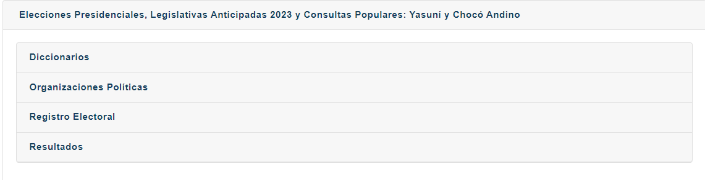
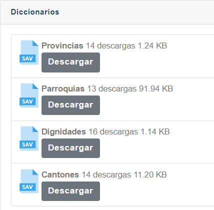
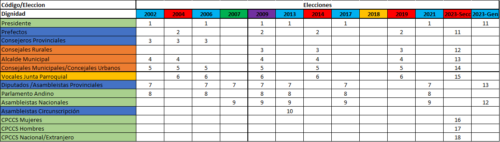
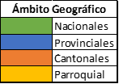
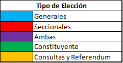
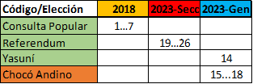

# Descripción de las Elecciones Ecuatorianas.
El Tribunal Supremo Electoral (TSE) era el encargado de realizar las elecciones a partir del año 2000. En el 2009, el TSE fue reemplazado por el Consejo Nacional Electoral (CNE) que es el organismo encargado de organizar y realizar las elecciones en Ecuador.

En el año 2009 se realizaron elecciones para elegir a todos los cargos de elección popular, dado que se aprobó en el 2008 la nueva Constitución de la República del Ecuador por medio de una consulta popular. 

### Ambito Geográfico
Las elecciones en Ecuador se realizan en 4 ambitos geográficos: Nacional, Provincial, Cantonal y Parroquial. Y adicionalmente existe las circunscripciones en determinados territorios.

## Generales
Son las elecciones conocidas también como uninominales, en las que se elige a un solo candidato para un cargo específico. En Ecuador, se elige al Presidente, Prefectos, Alcaldes, Representantes de Junta Parroquial  

### Años
Tabla

2002
2006
2009
2013
2017
2021
2023

### Dignidades
#### Presidente
#### Prefecto
#### Alcalde
#### Representante de Junta Parroquial

## Seccionales
Son las elecciones conocidas también como plurinominales, en las que se elige a varios candidatos para un cargo específico. En Ecuador, se elige a los consejales y asambleístas.

### Años
Del 2004 al 2019 se realizaron cada 5 años. A partir del 2019 se realizaron cada 4 años.

2004
2009
2014
2019
2023

### Dignidades
#### Consejales
#### Asambleístas

## Consultas Populares y Referendums
Las consultas populares y referendums son mecanismos de participación ciudadana que se realizan para que la ciudadanía se pronuncie sobre temas de interés general. Las consultas populares son convocadas por el Presidente de la República y los referendums son convocados por la Asamblea Nacional.

Referendums y consultas populares
-	Consulta Popular de Ecuador de 2006
-	Referéndum aprobatorio de Ecuador de 2007
-	Referéndum constitucional de Ecuador de 2008
-	Referéndum constitucional y consulta popular de Ecuador de 2011
-	Consulta popular de Ecuador de 2017
-	Referéndum constitucional y consulta popular de Ecuador de 2018
-	Consulta popular de Ecuador sobre el Yasuní de 2023 
-	Consulta popular al cantón Quito sobre el Choco Andino

### Años
### Relevancia
Para el proyecto se va a considerar las elecciones generales y seccionales. Las consultas populares y referendums no se van a considerar en el proyecto. Ya que no se tiene información de las preguntas que se realizaron en las consultas populares y referendums. Y no hay comparabilidad entre las preguntas de las consultas populares y referendums.

# Descripción de la Estructura actual del CNE
Por cada eleccion se tienen 4 carpetas de información.

 Las carpetas son las siguientes:

Se describe la información que se obtiiene de cada uno de las carpetas.
Todos se encuentran en formato ".sav"

Como referencia se va a explicar la estructura de las votaciones anticipadas del 2023

## Diccionarios

### Dignidades
Se encuentra el código, de qué ambito (Nacional, Provincial, Cantonal, Parroquial) y el nombre de la dignidad.
El código es único para cada dignidad. Sin embargo hay cambios de nombres en las dignidades, y en algunos casos se repiten los códigos.
A continuación se encuentra la tabla de los códigos de las dignidades por cada elección que se tiene en el CNE.

Tabla de dignidades

Solo para los años 2018-2023 se tiene la información de las consultas populares y referendums.

### Provincias
Se encuentra el código de la provincia y el nombre de la provincia.
### Cantones
Se encuentra el código del cantón y el nombre del cantón.
Este código no es estandarizado y existen cambios de códigos de un año a otro.

### Parroquias
Se encuentra el código de la parroquia y el nombre de la parroquia.
Este código no es estandarizado y existen cambios de códigos de un año a otro.
Además, hay parroquias que cambian de provincia y cantón de un año a otro. Por Ejemplo: La parroquia Manga del Cura en el 2023 pertenece a la provincia de Esmeraldas y al cantón de San Lorenzo. En el 2021 pertenecía a la provincia de Manabí y al cantón de Manta.

## Registro electoral
Se tiene la información sobre los electores por cada parroquia

## Organizaciones Políticas
Información sobre las organizaciones políticas y sus candidatos

### Problemas
- Inconsistencia en los códigos de las organizaciones de año a año
- Ausencia de código unico de candidatos.

## Resultados
- Se tiene la información por cada una de las juntas receptoras del voto

# Descripción de la Estructura de los resultados
La unidad mínima de agregación del voto es la Junta Receptora del Voto
## Columnas
No existe un código para identificar la junta receptora del voto
- Código de la provincia
- Código del cantón
- Código de la parroquia
- Código de la Circunscripción
- Genero de la junta
- 
## Problemas
Inconsistencia en las bases
Se provee de una tabla que identifica los cambios de nombres de las columnas de las bases de datos de los años 2002-2023

 ** Tabla**

# Descripción del Modelo de la Tesis
Dividir en 3 para evitar redundancia

## Info espacial y nominal de la junta receptora

## Info Votación en la junta receptora

## Info de la elección de la junta receptora

# Creación del paquete 

## Metodos planteados

