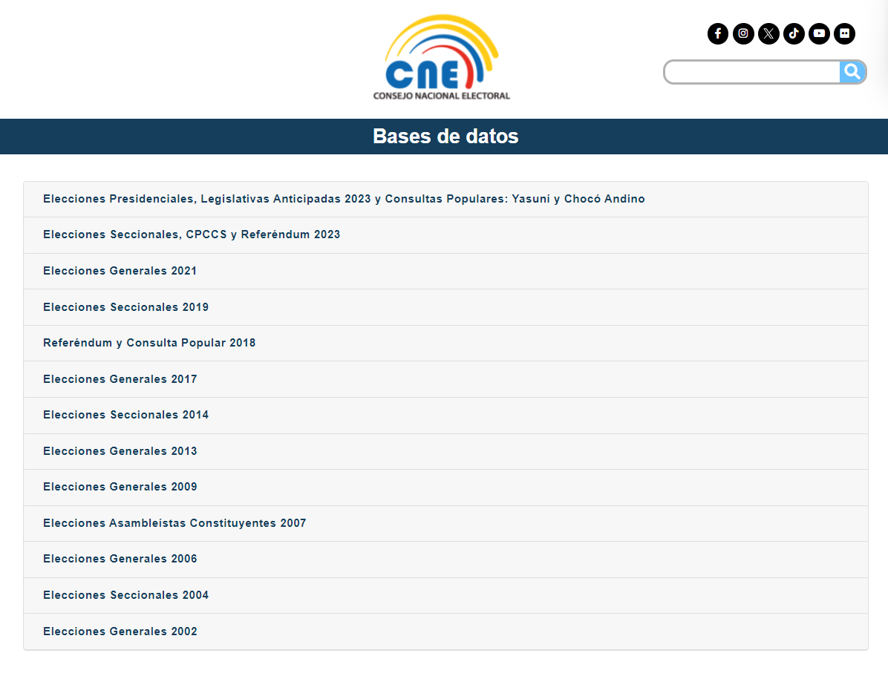

# Open-ELEC
Open-ELEC es un proyecto de código abierto basado en Python diseñado para mejorar la accesibilidad y el análisis de los resultados electorales oficiales en Ecuador. Este proyecto proporciona una biblioteca de Python para recuperar y analizar eficientemente los resultados de las elecciones de Ecuador. La información oficial es proporcionada por el Consejo Nacional Electoral del Ecuador.
# Descripción


Para más información revisar el documento de [Contexto](Context.md)
# Datos Oficiales
Los datos oficiales son proporcionados por el Consejo Nacional Electoral del Ecuador.

## Descarga
Los datos oficiales se encuentran disponibles en el [portal de datos abiertos del CNE](https://www.cne.gob.ec/estadisticas/bases-de-datos/)



* Para más información revisar el documento de [Contexto](Context.md)   
## Procesamiento

# Requisitos
Python 3.7 o superior, compatible con Pandas, Numpy, Geopandas, Matplotlib, Seaborn, entre otros.

# Instalación
```bash
pip install open-elec
```

# Uso

```python
import open_elec as oe
```


# Contribuciones o Dudas
Para contribuir o reportar errores, por favor abrir un issue en el repositorio de GitHub.


# Agracedimientos
Datahub, Pablo Astudillo, Pablo Medina

# Información Legal
## Ley de datos personales en Ecuador


# Licencia del Proyecto
Este proyecto está bajo la licencia MIT. Para más información revisar el archivo [LICENSE](LICENSE)
## Licencia de los Datos
Los datos oficiales son de dominio público. 
Los datos procesados por Open-ELEC son de dominio público. ** Revisar**


# Citación
Para citar este proyecto, por favor use la siguiente referencia:
```
@misc{Open-ELEC,
  author = {Kristian Mendoza},
    title = {Open-ELEC},
    year = {2023},
    publisher = {GitHub},
    journal = {GitHub repository},    
}
```
# Contacto
Para cualquier duda o comentario, por favor contactar a Kristian Mendoza o al Datahub.


# Apendices
## Apendice de la Licencia
