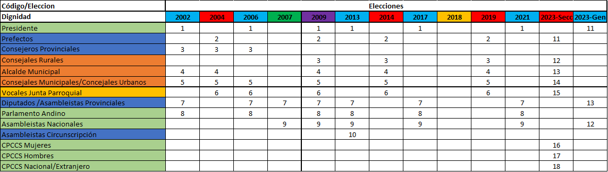
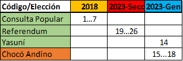

# Descripción de las Elecciones Ecuatorianas.
## Autoridad Electoral
Desde 1945, el Tribunal Supremo Electoral (TSE) había sido el ente responsable de la organización de las elecciones en Ecuador. Sin embargo, en 2009, el TSE fue sustituido por el Consejo Nacional Electoral (CNE), conforme a lo dispuesto en la nueva Constitución de 2008, aprobada mediante consulta popular. El CNE, junto con el Tribunal Contencioso, surgidos de esta nueva carta magna, asumió la responsabilidad de coordinar y ejecutar las elecciones presidenciales, legislativas y seccionales de 2009. (Consejo Nacional Electoral (Ecuador), 2024)

## Ámbito Geográfico
El ámbito geográfico de las elecciones en Ecuador se divide en cuatro niveles: Nacional, Provincial, Cantonal y Parroquial. Además, se establecen circunscripciones en ciertas áreas como la provincia de Manabí, así como en ciudades como Cuenca, Guayaquil y Quito, basadas en consideraciones demográficas. (Consejo Nacional Electoral, 2018). Adicionalmente, para el voto en el exterior, se consideran a las regiones de Latinoamérica, Asía, el Caribe, Europa, Oceanía, África y Norteamérica, dentro de las circunscripciones que participan en el proceso electoral. (Consejo Nacional Electoral, 2018)

## Elecciones Generales:
En estas elecciones se eligen al Presidente, asambleístas y al Parlamento Andino. (Consejo Nacional Electoral, 2018). Estas elecciones se realizan idealmente cada 4 años, con registros de votaciones en los años 2002, 2006, 2009, 2013, 2017, 2021 y 2023. Es importante mencionar que en el año 2007 no se considera elección general, ya que fue elección de asambleístas constituyentes, quienes fueron responsables de la elaboración de la nueva constitución del país. La elección del 2009 se dio anticipadamente dado el cambio en la constitución, lo que produce el sufragio para las dignidades. La elección del año 2023 fue una elección anticipada, dado que se aplicó el mecanismo conocido como la muerte cruzada por el expresidente Guillermo Lasso. Esto consiste en la disolución inmediata de la Asamblea y el cese de funciones del Presidente en 90 días. Con lo cual el Consejo Nacional electoral tiene la obligación de llamar a nuevas elecciones para estas dos dignidades. (López & González, 2023)

## Elecciones Seccionales
Son las elecciones en las que se escogen a prefectos, alcaldes y representantes de juntas parroquiales. (Consejo Nacional Electoral, 2018)
Cada una las provincias (excepto la Provincia de las Galápagos) tiene un prefecto y un gobierno provincial conformado por todos los alcaldes de los cantones de la provincia, que son elegidos por votación popular, junto a un gobierno municipal conformado por concejales urbanos y rurales según corresponda. Los cantones a su vez están subdivididos en parroquias, dirigida por vocales miembros de las Juntas parroquiales. (Elecciones seccionales de Ecuador de 2023, 2024)
Estas elecciones se han llevado a cabo en los años 2004, 2009, 2014, 2019 y 2023. Se observa un intervalo de 5 años entre 2004 y 2019, debido a que inicialmente se estableció este período para estas dignidades. Sin embargo, a partir de 2009, se implementó un desfase de 2 años con las elecciones generales, lo que permitió la alineación de los procesos electorales cada 4 años a partir de 2019. La información disponible sobre esta información solía estar en la página del Consejo Nacional Electoral (CNE), a la fecha de este documento ha sido eliminada por la consulta popular del 21 de abril de 2024.

## Elecciones unipersonales
En Ecuador, las elecciones unipersonales se distinguen por la selección de un solo candidato para un cargo específico, abarcando la elección de Presidentes, prefectos, alcaldes y representantes de juntas parroquiales. En este sistema de votación, el ganador es aquel candidato que obtenga más de la mitad de los votos válidos. Desde 1998, se ha establecido que un candidato también puede ganar si obtiene más del 40% de los votos, siempre y cuando mantenga una diferencia de al menos el 10% sobre el segundo candidato. Estos porcentajes se calculan sobre el total de votos válidos, excluyendo votos nulos y en blanco. En el caso de las elecciones presidenciales, si ningún candidato logra obtener la mayoría absoluta en la primera votación, se lleva a cabo un balotaje o segunda vuelta entre los dos candidatos con más votos. (Elecciones en Ecuador, 2024)

## Elecciones pluripersonales
En este tipo de elecciones se eligen a varios representantes para una dignidad, se abarcan a los asambleístas y concejales. Dentro del ámbito de los asambleístas, se distinguen dos categorías: los Provinciales y los Nacionales. Asimismo, en el caso de los concejales, se dividen en rurales y urbanos. En ambos casos, la asignación de escaños se emplea en lugar de determinar los ganadores mediante el método de voto popular. El método de asignación de escaños que se utiliza actualmente es el de Webster, que fue insertado en el año 2009 y luego reintroducido en el 2021. Esta decisión se tomó como resultado de las reformas implementadas en el Código de la Democracia, que entró en vigor en el 2020.
Conforme a estas reformas, se estableció que las elecciones en listas pluripersonales se decidirían mediante el método Webster en lugar del método D’Hondt. El método Webster tiene la particularidad de favorecer a las minorías, ya que se divide el total de votos obtenidos por números impares (1, 3, 5, 7 y más), hasta alcanzar el número de escaños disponibles. Mientras que el método D’Hondt utiliza números consecutivos (1,2,3,4,5 y más). (Paez, 2022)

## Consultas Populares y referéndums
El proceso de consulta popular se emplea cuando se desea modificar una ley en vigor, particularmente en asuntos vinculados a políticas económicas o sociales. Estos ajustes se centran en la conformidad de leyes secundarias con respecto a la Constitución, que constituye la máxima autoridad normativa de un país. Por otro lado, el referéndum representa un mecanismo de participación democrática directa, mediante el cual la ciudadanía determina modificaciones en artículos específicos de la Constitución nacional. (El Telégrafo, 2024)
Algunas de las consultas populares y referéndums de los últimos 20 años han sido:
- Consulta Popular de Ecuador de 2006
- Referéndum aprobatorio de Ecuador de 2007
- Referéndum constitucional de Ecuador de 2008
- Referéndum constitucional y consulta popular de Ecuador de 2011
- Consulta popular de Ecuador de 2017
- Referéndum constitucional y consulta popular de Ecuador de 2018
- Consulta popular de Ecuador sobre el Yasuní de 2023
- Consulta popular al cantón Quito sobre el Choco Andino de 2023
- Consulta popular y referéndum de Ecuador de 2024 (Ronquillo, 2024)

Para el proyecto se va a considerar las elecciones generales y seccionales. Las consultas populares y referéndums no se van a considerar en el proyecto. Ya que no se tiene información de las preguntas que se realizaron en las consultas populares y referéndums. Además, no hay comparabilidad entre las preguntas de los años y no hay la información de todas ellas.
Se adjunta una tabla en la sección de anexos con la información de los códigos asignados por el CNE a las dignidades, y en qué año se puede encontrar información de estas elecciones. 

# Descripción de las Bases de Datos

## Tabla de dignidades

Solo para los años 2018-2023 se tiene la información de las consultas populares y referendums.

### Provincias
Se encuentra el código de la provincia y el nombre de la provincia.

### Cantones
Se encuentra el código del cantón y el nombre del cantón.
Este código no es estandarizado y existen cambios de códigos de un año a otro.

### Parroquias
Se encuentra el código de la parroquia y el nombre de la parroquia.
Este código no es estandarizado y existen cambios de códigos de un año a otro.
Además, hay parroquias que cambian de provincia y cantón de un año a otro. Por Ejemplo: La parroquia Manga del Cura en el 2023 pertenece a la provincia de Esmeraldas y al cantón de San Lorenzo. En el 2021 pertenecía a la provincia de Manabí y al cantón de Manta.

## Registro electoral
Se tiene la información sobre los electores por cada parroquia.

## Organizaciones Políticas
Información sobre las organizaciones políticas y sus candidatos.

### Problemas
- Inconsistencia en los códigos de las organizaciones de año a año.
- Ausencia de código único de candidatos.

## Resultados
- Se tiene la información por cada una de las juntas receptoras del voto.

# Descripción de la Estructura de los resultados
La unidad mínima de agregación del voto es la Junta Receptora del Voto.

## Columnas
No existe un código para identificar la junta receptora del voto.
- Código de la provincia.
- Código del cantón.
- Código de la parroquia.
- Código de la Circunscripción.
- Género de la junta.

## Problemas
Inconsistencia en las bases.
Se provee de una tabla que identifica los cambios de nombres de las columnas de las bases de datos de los años 2002-2023.